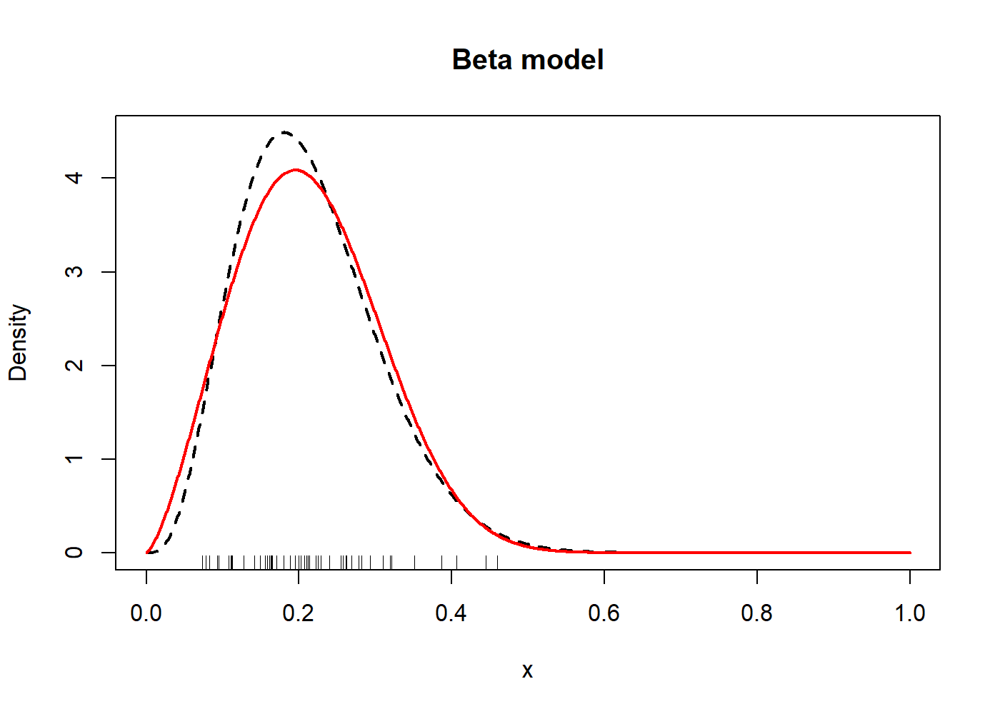
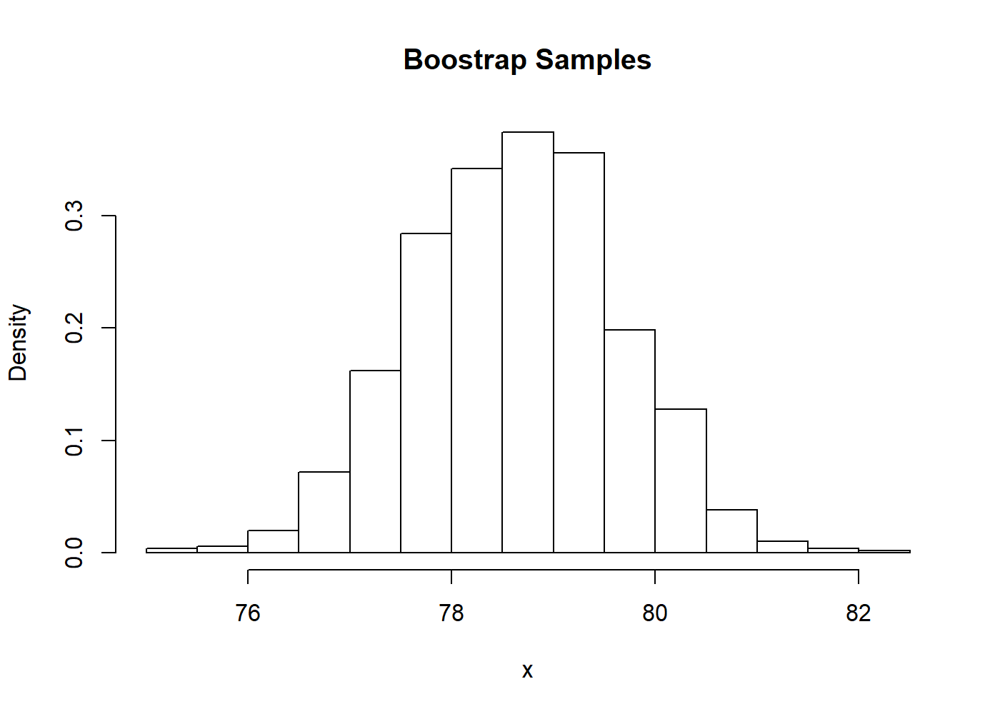
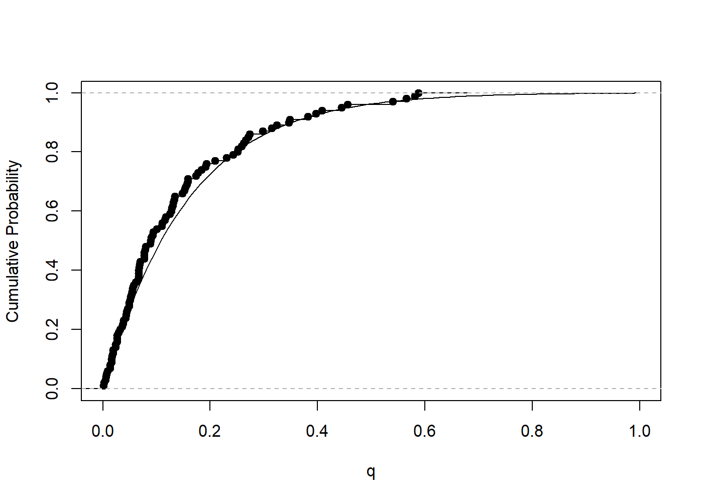

<!-- README.md is generated from README.Rmd. Please edit that file -->

# univariateML 

[](https://travis-ci.org/JonasMoss/univariateML)
[](https://ci.appveyor.com/project/JonasMoss/univariateML)
[](https://codecov.io/gh/JonasMoss/univariateML?branch=master)
[](https://www.repostatus.org/#wip)

An `R` package for quick and easy maximum likelihood estimation of
univariate densities.

## Overview

This package provided fast and easy maximum likelihood estimation for a
selection of univariate densities. This is work in progress.

## Installation

From inside `R`, use one of the following commands:

``` r
# install.packages("devtools")
devtools::install_github("JonasMoss/univariateML")
```

## Examples

### Model Selection

The `airquality` contains daily air quality measurements in New York
from May to September 1973. To choose a model for the wind speed
measurements from this data set we will use AIC.

``` r
library("univariateML")
AIC(mlbetapr(airquality$Wind),
    mlexp(airquality$Wind),
    mlinvgamma(airquality$Wind),
    mlgamma(airquality$Wind),
    mllnorm(airquality$Wind),
    mlrayleigh(airquality$Wind),
    mlinvgauss(airquality$Wind),
    mlweibull(airquality$Wind))
#>                             df       AIC
#> mlbetapr(airquality$Wind)    2  859.2844
#> mlexp(airquality$Wind)       1 1011.2883
#> mlinvgamma(airquality$Wind)  2  868.5739
#> mlgamma(airquality$Wind)     2  825.0259
#> mllnorm(airquality$Wind)     2  839.7377
#> mlrayleigh(airquality$Wind)  1  856.8326
#> mlinvgauss(airquality$Wind)  2  846.0295
#> mlweibull(airquality$Wind)   2  820.9584
```

The superior AIC of the Weibull distribution makes it a reasonable
choice.

### Plotting

The package supports easy plotting of the fitted densities.

``` r
plot(mlbeta(USArrests$Rape/100), lwd = 2, lty = 2)
lines(mlkumar(USArrests$Rape/100), lwd = 2, col = "red")
rug(USArrests$Rape/100)
```



### Probability Plots

### Parametric Bootstrap

This package has builtin suppor for parametric
bootstrap.

``` r
# Calculate two-sided 95% confidence intervals for the two Gumbel parameters.
obj = mlgumbel(airquality$Temp)
bootstrapml(obj)
#>            2.5%    97.5%
#> mu    71.368393 74.67159
#> sigma  8.506768 10.87087
```

Using the `map` function you can calculate functions of the parameters
as well. The `map` function takes one vector argument containing the
estimated parameters of the distribution and it applied to each
bootstrap iteration. The mean of a Gumbel distribution is `shape +
beta*gamma`, where gamma is the Euler–Mascheroni constant (which can be
calculcated by calling
`-digamma(1)`).

``` r
# Calculate two-sided 95% confidence intervals for the two Gumbel parameters.
bootstrapml(obj, map = function(x) x[1] - x[2]*digamma(1), probs = c(0.05, 0.95))
#>       5%      95% 
#> 77.08515 80.23095
```

The parameter `probs` is passed to the `quantile` function, and can be
used to control the confidence limits of the confidence interval. In the
example above it is `c(0.05, 0.95)`, which yields a 90% confidence
interval.

The `bootstrapml` function has support for reducers via the `reducer`
argument. After `map` is applied, we are left with a k-dimensional array
of values, where k is the parameter dimension of the distribution
(i.e. for the Gumbel distribution k is 2). `reducer` is applied to each
row of this array. The default reducer is `quantile`, but reducers such
as `identity` can also be useful-

``` r
# Make histogram of the bootstrap samples.
hist(bootstrapml(obj, 
                 map = function(x) x[1] - x[2]*digamma(1), 
                 reducer = identity),
     main = "Boostrap Samples",
     xlab = "x",
     freq = FALSE)
```



### Distribution Functions

Density functions (`dml`), cumulative distribution functions (`pml`),
quantile functions (`qml`), and random variate generation (`rml`) is
supported
too.

``` r
# Compare empirical cumulative distribution to the true cumulative distribution.
set.seed(313)
obj = mlgamma(attenu$accel)
q = seq(0, 1, length.out = 100)
plot(q, pml(q, obj), type = "l", ylab = "Cumulative Probability")
r = rml(100, obj)
lines(ecdf(r))
```



## Implemented Densities

Maximum likelihood estimation has been implemented for the following
densites.

| Name                          | Package    | Parameters         | Density     | Support      |
| ----------------------------- | ---------- | ------------------ | ----------- | ------------ |
| Normal distribution           | stats      | `mean`, `sd`       | `dnorm`     | ℝ            |
| Logistic distributon          | stats      | `location`,`scale` | `dlogis`    | ℝ            |
| Cauchy distributon            | stats      | `location`,`scale` | `dcauchy`   | ℝ            |
| Gumbel distribution           | extraDistr | `mu`, `sigma`      | `dgumbel`   | ℝ            |
| Laplace distribution          | extraDistr | `mu`, `sigma`      | `dlaplace`  | ℝ            |
| Exponential distribution      | stats      | `rate`             | `dexp`      | \[0, ∞)      |
| Lomax distribution            | extraDistr | `lambda`, `kappa`  | `dlomax`    | \[0, ∞)      |
| Rayleigh distribution         | extraDistr | `sigma`            | `drayleigh` | \[0, ∞)      |
| Gamma distribution            | stats      | `shape`,`rate`     | `dgamma`    | (0, ∞)       |
| Weibull distribution          | stats      | `shape`,`scale`    | `dweibull`  | (0, ∞)       |
| Log-normal distribution       | stats      | `meanlog`, `sdlog` | `dlnorm`    | (0, ∞)       |
| Inverse gamma distribution    | extraDistr | `alpha`, `beta`    | `dinvgamma` | (0, ∞)       |
| Beta prime distribution       | extraDistr | `shape1`, `shape2` | `dbetapr`   | (0, ∞)       |
| Inverse Gaussian distribution | statmod    | `mean`, `shape`    | `dinvgauss` | (0, ∞)       |
| Beta distibution              | stats      | `shape1`,`shape2`  | `dbeta`     | (0, 1)       |
| Kumaraswamy distribution      | extraDistr | `a`, `b`           | `dkumar`    | (0, 1)       |
| Uniform distribution          | stats      | `min`, `max`       | `dunif`     | \[min, max\] |
| Power distribution            | extraDistr | `alpha`, `beta`    | `dpower`    | \[0, a)      |
| Pareto distribution           | extraDistr | `a`, `b`           | `dpareto`   | \[b, ∞)      |

## How to Contribute or Get Help

If you encounter a bug, have a feature request or need some help, open a
[Github issue](https://github.com/JonasMoss/univariateML/issues). Create
a pull requests to contribute. This project follows a [Contributor Code
of
Conduct](https://www.contributor-covenant.org/version/1/4/code-of-conduct.md).

Please open an issue and or make a pull request if you want another
univariate distribution to be added to the package.
