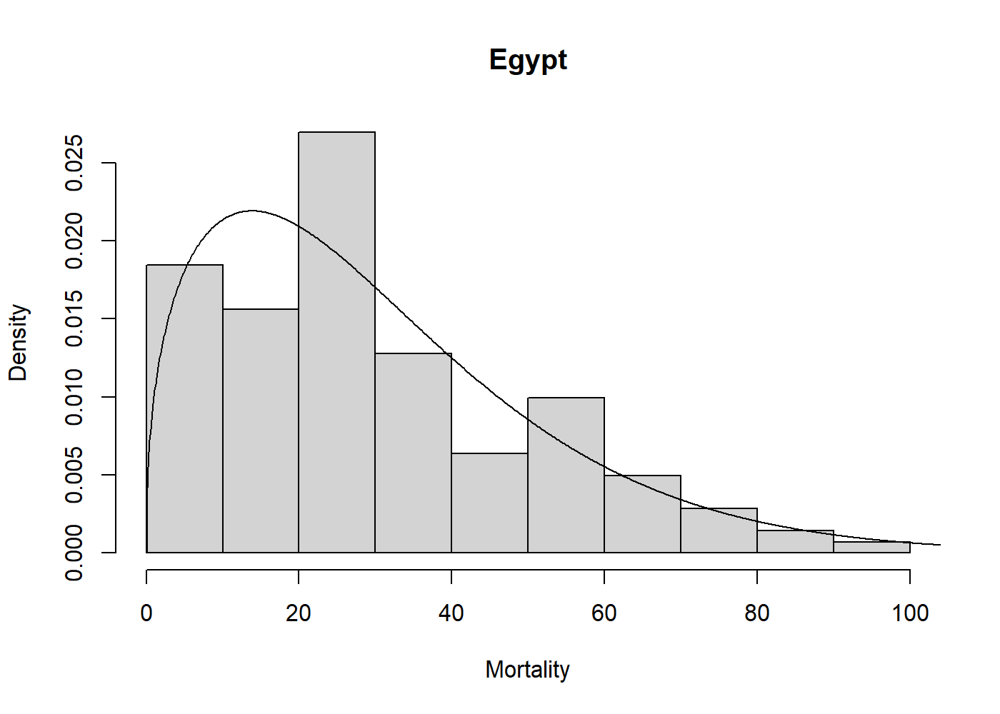

<!-- README.md is generated from README.Rmd. Please edit that file -->

# univariateML 

[](https://travis-ci.org/JonasMoss/univariateML)
[](https://ci.appveyor.com/project/JonasMoss/univariateML)
[](https://codecov.io/gh/JonasMoss/univariateML?branch=master)
[](https://www.repostatus.org/#active)

## Overview

An `R`-package for fast, easy, and reliable maximum likelihood
estimation for a
[selection](https://univariateml.netlify.com/articles/distributions.html)
of parametric univariate densities. In addition to basic estimation
capabilities, this package support visualization through `plot` and
`qqmlplot`, model selection by `AIC` and `BIC`, and confidence sets
through the parametric bootstrap with `bootstrapml`.

## Installation

Use the following command from inside `R`:

``` r
# install.packages("devtools")
devtools::install_github("JonasMoss/univariateML")
```

## Usage

The core of `univariateML` are the `ml***` functions, where `***` is a
distribution suffix such as `norm`, `gamma`, or `weibull`.

``` r
library("univariateML")
mlweibull(egypt$age)
#> Maximum likelihood estimates for the Weibull model 
#>  shape   scale  
#>  1.404  33.564
```

Now we can visually assess the fit of the Weibull model to the `egypt`
data with a plot.

``` r
hist(egypt$age, freq = FALSE, xlab = "Mortality", main = "Egypt")
lines(mlweibull(egypt$age))
```



## Documentation

For an overview of the package and its features see the [overview
vignette](https://univariateml.netlify.com/articles/overview.html). For
a list of implemented densities see the start of the [details
vignette](https://univariateml.netlify.com/articles/distributions.html).
For an illustration of how this package can make an otherwise long and
laborious process much simpler, see the [copula
vignette](https://univariateml.netlify.com/articles/copula.html).

## How to Contribute or Get Help

Please read `CONTRIBUTING.md` for details about how to contribute or get
help.
