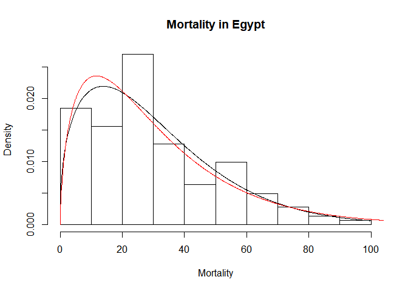

# Summary

`univariateML` is an R [@r] package for univariate maximum likelihood estimation [@lecam1990ml]. 
It supports more than 20 densities, the most popular generic functions such as `plot`, `AIC`, and `confint`, and a simple parametric bootstrap [@efron1994introduction] interface.

When looking at univariate data it is natural to ask if there is a known 
parametric density that fits the data well. The following example uses the 
`egypt` [@pearson1902egypt] data set included in the package and a plot of the Weibull and Gamma
densities [@johnson1970continuous, Chapter 17 & 21]. 


``` r
# install.packages("univariateML")
library("univariateML")
hist(egypt$age, freq = FALSE, main = "Mortality", xlab = "Mortality")
lines(mlweibull(egypt$age)) # Plots a Weibull fit.
lines(mlgamma(egypt$age), col = "red")  # Plots a Gamma fit.
```

<!-- -->

A natural question to ask is which among several models fits the data best.
This can be done using tools of model selection such as the `AIC` [@akaike1998information].

``` r
AIC(mlweibull(egypt$age),
    mlgamma(egypt$age))
```

    ##                      df      AIC
    ## mlweibull(egypt$age)  2 1230.229
    ## mlgamma(egypt$age)    2 1234.772


Problems involving estimation of univariate densities are common in statistics. 
Estimation of univariate densities is used in for instance exploratory data analysis, 
in the estimation of copulas [@ko2019focused],
as parametric starts in density estimation [@hjort_glad_1995; @moss2019kdensity], 
and is of interest in and of itself. 

`univariateML` exists to simplify the whole process of doing inference with univariate densities.
For most densities implemented in `R` the maximum likelihood estimates can easily
be computed using numerical optimization functions such as `stats::nlm` and
`stats::optim` on the negative log-likelihood, but there are three problems 
with this solution strategy:

1. It takes much time to program, especially if we wish to try out many densities and
   wish to make for instance `qqplot` or density plots.
2. It is bug prone.
3. The estimation itself can be slow when the sample size is large. The time lost quickly adds up
   when doing the parametric bootstrap or another procedure requiring repeated calls to
   the estimating function.

In short, it is inconvenient to program these solutions by hand.

`univariateML` has custom made optimizers for each supported density.
This is in contrast to the `mle` function in the built-in `R` package `stats4`,
which supports far more general maximum likelihood estimation through numerical
optimization on a supplied negative log-likelihood function.

Analytic formulas for the maximum likelihood estimates are used whenever 
they exist. Most estimators without analytic solutions have a custom made 
Newton-Raphson solver. The speedup can be substantial, as seen in the following 
Gamma distribution example:

``` r
set.seed(313)
x <- rgamma(500, 2, 7)

microbenchmark::microbenchmark(
  univariateML = univariateML::mlgamma(x),
  naive = nlm(function(p) -sum(dgamma(x, p[1], p[2], log = TRUE)),
                               p = c(1, 1)))
```

    ## Unit: microseconds
    ##          expr     min       lq      mean   median       uq     max neval
    ##  univariateML   606.2   792.75  1093.802   991.60  1073.65  7346.8   100
    ##         naive 26276.8 28647.45 30616.039 29209.85 30378.25 69477.2   100

# References