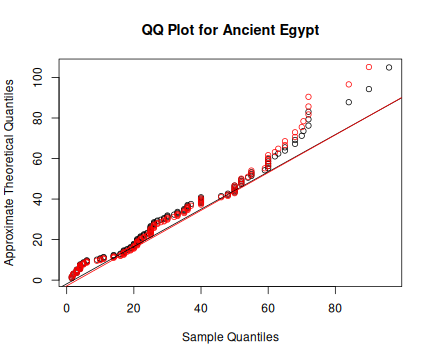

When dealing with univariate data you want to do one or more of
* Find a good model for the data.
* Estimate parameters for your candidate models.
* Get an idea about the uncertainty of your estimates.

The `unvariateML` package has a fast and reliable functions to help you with 
these tasks. The core of the package are more than 20 functions for fast 
and thoroughly tested calculation of maximum likelihood estimates for univariate 
models. 

* Compare the fit of your candidate models with `AIC` or `BIC`.
* Look at QQ plots or PP plots of your data.
* Plot the data together with density estimates.
* Compute confidence intervals using parameteric bootstrap.

This vignette shows you how to use the tools of `univariateML` to do exploratory
data analysis on 

# Mortality in Ancient Egypt

The dataset `egypt` contains contains the age at death of 141 Roman era Egyptian
mummies. 


```r
library("univariateML")
head(egypt)
```

```
## # A tibble: 6 x 2
##     age sex  
##   <dbl> <chr>
## 1  1.5  male 
## 2  1.83 male 
## 3  2    male 
## 4  2    male 
## 5  3    male 
## 6  3    male
```

```r
hist(egypt$age, main = "Mortality in Ancient Egypt", freq = FALSE)
```


# Comparing Many Models with AIC
Since all the data is positive we will only try densities support on the positive
half-line. 


```r
AIC(mlbetapr(egypt$age),
    mlexp(egypt$age),
    mlinvgamma(egypt$age),
    mlgamma(egypt$age),
    mllnorm(egypt$age),
    mlrayleigh(egypt$age),
    mlinvgauss(egypt$age),
    mlweibull(egypt$age))
```

```
##                       df      AIC
## mlbetapr(egypt$age)    2 1312.464
## mlexp(egypt$age)       1 1249.553
## mlinvgamma(egypt$age)  2 1322.949
## mlgamma(egypt$age)     2 1234.772
## mllnorm(egypt$age)     2 1263.874
## mlrayleigh(egypt$age)  1 1260.217
## mlinvgauss(egypt$age)  2 1287.124
## mlweibull(egypt$age)   2 1230.229
```

The [Weibull](https://en.wikipedia.org/wiki/Weibull_distribution) and
[Gamma](https://en.wikipedia.org/wiki/Gamma_distribution) models stand out.

# Quantile-quantile Plots
Now we will investigate how the two models differ with a quantile-quantile plots
, or Q-Q plots for short.


```r
qqmlplot(egypt$age, mlweibull, datax = TRUE, main = "QQ Plot for Ancient Egypt")
qqmlpoints(egypt$age, mlgamma, datax = TRUE, col = "red")
qqmlline(egypt$age, mlweibull, datax = TRUE)
qqmlline(egypt$age, mlgamma, datax = TRUE, col = "red")
```



The QQ plot shows that neither Weibull nor Gamma fits the data very well. 

# Plot Densities


```r
hist(egypt$age, main = "Mortality in Ancient Egypt", freq = FALSE)
lines(mlweibull(egypt$age), lwd = 2, lty = 2, ylim = c(0, 0.025))
lines(mlgamma(egypt$age), lwd = 2, col = "red")
rug(egypt$age)
```


# Confidence Intervals with Parametric Bootstrap


```r
# Calculate two-sided 95% confidence intervals for the two Gumbel parameters.
bootstrapml(mlweibull(egypt$age))
```

```
##            2.5%     97.5%
## shape  1.246788  1.616233
## scale 29.506260 38.131920
```

```r
bootstrapml(mlgamma(egypt$age))
```

```
##             2.5%      97.5%
## shape 1.33650610 1.99794139
## rate  0.04207126 0.06868779
```

These confidence intervals are not directly comparable since the parameters do 
not mean the same. So let us take a look at a a parameter with a familiar 
interpretation, namely the mean. 

The mean of the Weibull distribution with parameters `shape` and `scale` is 
`scale*gamma(1 + 1/shape)`. On the other hand, the mean of the 
Gamma distribution with parameters `shape` and `rate` is
`shape/rate`. 


```r
# Calculate two-sided 90% confidence intervals for the two Gumbel parameters.
bootstrapml(mlweibull(egypt$age), 
            map = function(x) x[2]*gamma(1 + 1/x[1]), 
            probs = c(0.05, 0.95))
```

```
##       5%      95% 
## 27.70964 33.93543
```

```r
bootstrapml(mlgamma(egypt$age), 
            map = function(x) x[1]/x[2],
            probs = c(0.05, 0.95))
```

```
##       5%      95% 
## 27.33411 34.22503
```

We could also be interested in the quantiles of the underlying distribution,
for instance the median:


```r
# Calculate two-sided 90% confidence intervals for the two Gumbel parameters.
bootstrapml(mlweibull(egypt$age), 
            map = function(x) qweibull(0.5, x[1], x[2]), 
            probs = c(0.05, 0.95))
```

```
##       5%      95% 
## 23.03775 28.83034
```

```r
bootstrapml(mlgamma(egypt$age), 
            map = function(x) qgamma(0.5, x[1], x[2]), 
            probs = c(0.05, 0.95))
```

```
##       5%      95% 
## 21.87403 27.68279
```

We can also plot the bootstrap samples.


```r
hist(bootstrapml(mlweibull(egypt$age), 
                 map = function(x) x[2]*gamma(1 + 1/x[1]), 
                 reducer = identity),
     main = "Boostrap Samples of the Mean",
     xlab = "x",
     freq = FALSE)
```


