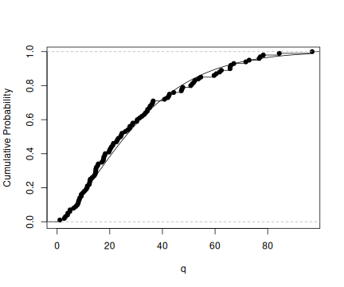

When dealing with univariate data you want to do one or more of
* Find a good model for the data.
* Estimate parameters for your candidate models.
* Get an idea about the uncertainty of your estimates.

The `unvariateML` package has a fast and reliable functions to help you with 
these tasks. The core of the package are more than 20 functions for fast 
and thoroughly tested calculation of maximum likelihood estimates for univariate 
models. 

* Compare the fit of your candidate models with `AIC` or `BIC`.
* Look at QQ plots or PP plots of your data.
* Plot the data together with density estimates.
* Compute confidence intervals using parametric bootstrap.

This vignette shows you how to use the tools of `univariateML` to do exploratory
data analysis.

# Mortality in Ancient Egypt

The dataset `egypt` contains contains the age at death of 141 Roman era Egyptian
mummies. Our first task is to find a univariate model that fits this data.


```r
library("univariateML")
head(egypt)
```

```
## # A tibble: 6 x 2
##     age sex  
##   <dbl> <chr>
## 1  1.5  male 
## 2  1.83 male 
## 3  2    male 
## 4  2    male 
## 5  3    male 
## 6  3    male
```

```r
hist(egypt$age, main = "Mortality in Ancient Egypt", freq = FALSE)
```


## Comparing Many Models with AIC
The [AIC](https://en.wikipedia.org/wiki/Akaike_information_criterion) is a handy 
and easy to use model selection tool, as it only depends on the loglikelihood and
number of parameters of the models. The \code{AIC} generic in `R` can take multiple
models, and the lower the \code{AIC} the better.

Since all the data is positive we will only try densities support on the positive
half-line. 


```r
AIC(mlbetapr(egypt$age),
    mlexp(egypt$age),
    mlinvgamma(egypt$age),
    mlgamma(egypt$age),
    mllnorm(egypt$age),
    mlrayleigh(egypt$age),
    mlinvgauss(egypt$age),
    mlweibull(egypt$age),
    mlinvweibull(egypt$age),
    mllgamma(egypt$age))
```

```
##                         df      AIC
## mlbetapr(egypt$age)      2 1312.464
## mlexp(egypt$age)         1 1249.553
## mlinvgamma(egypt$age)    2 1322.949
## mlgamma(egypt$age)       2 1234.772
## mllnorm(egypt$age)       2 1263.874
## mlrayleigh(egypt$age)    1 1260.217
## mlinvgauss(egypt$age)    2 1287.124
## mlweibull(egypt$age)     2 1230.229
## mlinvweibull(egypt$age)  2 1319.120
## mllgamma(egypt$age)      2 1314.187
```

The [Weibull](https://en.wikipedia.org/wiki/Weibull_distribution) and
[Gamma](https://en.wikipedia.org/wiki/Gamma_distribution) models stand out with
an AIC far below the other candidate models.

To see the parameter estimates of `mlweibull(egypt$age)` just print it:

```r
mlweibull(egypt$age)
```

```
## Maximum likelihood estimates for the Weibull model 
##  shape   scale  
##  1.404  33.564
```

`mlweibull(egypt$age)` is a `univariateML` object. For more details about it call `summary`:


```r
summary(mlweibull(egypt$age))
```

```
## 
## Maximum likelihood for the Weibull model 
##  
## Call:  mlweibull(x = egypt$age) 
## 
## Estimates: 
##     shape      scale  
##  1.404158  33.563564  
## 
## Data:            egypt$age (141 obs.)
## Support:         (0, Inf)
## Density:         stats::dweibull
## Log-likelihood:  -613.1144
```

## Quantile-quantile Plots
Now we will investigate how the two models differ with [https://en.wikipedia.org/wiki/Q%E2%80%93Q_plot](quantile-quantile plots), or Q-Q plots for short.


```r
qqmlplot(egypt$age, mlweibull, datax = TRUE, main = "QQ Plot for Ancient Egypt")
# Can also use qqmlplot(mlweibull(egypt$age), datax = TRUE) directly.
qqmlpoints(egypt$age, mlgamma, datax = TRUE, col = "red")
qqmlline(egypt$age, mlweibull, datax = TRUE)
qqmlline(egypt$age, mlgamma, datax = TRUE, col = "red")
```


The Q-Q plot shows that neither Weibull nor Gamma fits the data very well.

If you prefer P-P plots to Q-Q plots take a look at `?ppplotml` instead. 

## Plot Densities

Use the `plot`, `lines` and `points` generics to plot the densities.


```r
hist(egypt$age, main = "Mortality in Ancient Egypt", freq = FALSE)
lines(mlweibull(egypt$age), lwd = 2, lty = 2, ylim = c(0, 0.025))
lines(mlgamma(egypt$age), lwd = 2, col = "red")
rug(egypt$age)
```


## Confidence Intervals with Parametric Bootstrap

Now we want to get an idea about the uncertainties of our model parameters. 
Do do this we can do a parametric bootstrap to calculate confidence intervals using either
`bootstrapml` or `confint`. While `bootstrapml` allows you to calculate any
functional of the parameters and manipulate them afterwards, `confint` is restricted
to the main parameters of the model.


```r
# Calculate two-sided 95% confidence intervals for the two Gumbel parameters.
bootstrapml(mlweibull(egypt$age)) # same as confint(mlweibull(egypt$age))
```

```
##            2.5%     97.5%
## shape  1.247094  1.602796
## scale 29.677225 37.611388
```

```r
bootstrapml(mlgamma(egypt$age))
```

```
##             2.5%      97.5%
## shape 1.28831004 2.04744768
## rate  0.04091899 0.06916701
```

These confidence intervals are not directly comparable. That is, the `scale` parameter in
the Weibull model is not directly comparable to the `rate` parameter in the gamma model. 
So let us take a look at a a parameter with a familiar interpretation, namely the mean. 

The mean of the Weibull distribution with parameters `shape` and `scale` is 
`scale*gamma(1 + 1/shape)`. On the other hand, the mean of the 
Gamma distribution with parameters `shape` and `rate` is
`shape/rate`. 

The `probs` argument can be used to modify the limits of confidence interval. Now
we will calculate two 90% confidence intervals for the mean. 


```r
# Calculate two-sided 90% confidence intervals for the mean of a Weibull.
bootstrapml(mlweibull(egypt$age), 
            map = function(x) x[2]*gamma(1 + 1/x[1]), 
            probs = c(0.05, 0.95))
```

```
##       5%      95% 
## 27.70631 33.86676
```

```r
# Calculate two-sided 90% confidence intervals for the mean of a Gamma.
bootstrapml(mlgamma(egypt$age), 
            map = function(x) x[1]/x[2],
            probs = c(0.05, 0.95))
```

```
##       5%      95% 
## 27.29624 33.89027
```

We are be interested in the quantiles of the underlying distribution,
for instance the median:


```r
# Calculate two-sided 90% confidence intervals for the two Gumbel parameters.
bootstrapml(mlweibull(egypt$age), 
            map = function(x) qweibull(0.5, x[1], x[2]), 
            probs = c(0.05, 0.95))
```

```
##       5%      95% 
## 22.93239 28.88371
```

```r
bootstrapml(mlgamma(egypt$age), 
            map = function(x) qgamma(0.5, x[1], x[2]), 
            probs = c(0.05, 0.95))
```

```
##       5%      95% 
## 21.77523 27.57328
```

We can also plot the bootstrap samples.


```r
hist(bootstrapml(mlweibull(egypt$age), 
                 map = function(x) x[2]*gamma(1 + 1/x[1]), 
                 reducer = identity),
     main = "Bootstrap Samples of the Mean",
     xlab = "x",
     freq = FALSE)
```


## Density, CDF, quantiles and random variate generation

The functions `dml`, `pml`, `qml` and `rml` can be used to calculate densities,
cumulative probabilities, quantiles, and generate random variables. Here are
$10$ random observations from the most likely distribution of Egyptian mortalities given
the Weibull model.


```r
set.seed(313)
rml(10, mlweibull(egypt$age))
```

```
##  [1] 25.90552 59.64456 13.36882 44.29378 12.22563 17.66144 54.57633
##  [8] 22.86824 11.48328 19.94814
```

Compare the empirical distribution of the random variates to the true cumulative probability.


```r
set.seed(313)
obj = mlweibull(egypt$age)
q = seq(0, max(egypt$age), length.out = 100)
plot(q, pml(q, obj), type = "l", ylab = "Cumulative Probability")
r = rml(100, obj)
lines(ecdf(r))
```


